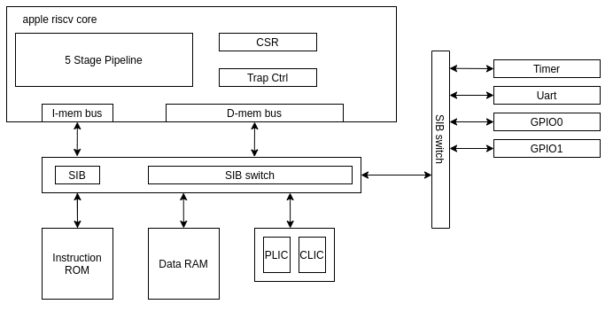

# Apple RISCV

## Introduction

Apple RISCV is a simple RISC-V CPU supporting RV32I instruction set.

Apple RISCV has the following features:

**Hardware Feature:**

- Supporting RV32I ISA, and other extensions ('Zicsr', mret, ecall, *ebreak*)
- 5 stage pipeline design with forwarding logic
- Support 4 basic interrupts (external, timer, software, *debug*)
- A complete soc design capable of running basic embedded task.
- The HDL code is written in SpinalHDL.

**Software Feature:**

- Support C programming language
- More features TBD

## Architecture

Here is a brief introduction of the design micro-architecture. For more details, check [micro_arch.md](doc/micro_arch.md)

### apple riscv core

The cpu core is designed as classic 5 stage pipeline, with other supporting logic such as csr (config and status register) module and trap controller.

### apple riscv soc

The apple riscv soc contains necessary peripherals for the cpu core to run basic embedded task.

