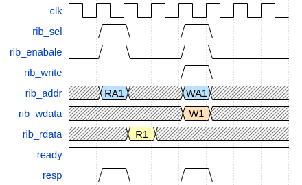
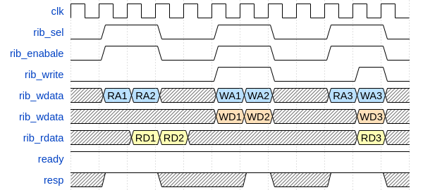
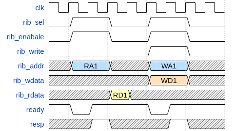
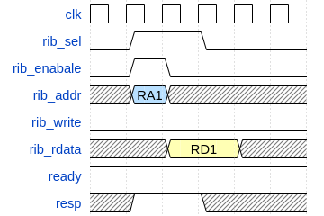

# Micro Architecture

## Apple RISCV soc

The apple riscv soc contains necessary peripherals for the cpu core to run basic embedded task.

The address range for each component is as follows:

| Component       | Address Range           | Size |
| --------------- | ----------------------- | ---- |
| Instruction ROM | 0x00000000 - 0x00FFFFFF | 16MB |
| Data RAM        | 0x01000000 - 0x01FFFFFF | 16MB |
| CLIC            | 0x02000000 - 0x02000FFF | 4KB  |
| PLIC            | 0x02001000 - 0x02001FFF | 4KB  |
| Timer           | 0x02002000 - 0x02002FFF | 4KB  |
| GPIO            | 0x02003000 - 0x02003FFF | 4KB  |
| Uart            | 0x02004000 - 0x02004FFF | 4KB  |

## SIB (Simple Internal Bus)

The Apple RISCV soc use **SIB** as the internal bus to connect each components.

Here are the SIB features:

- Point to point connection, supporting complex connection such as bus matrix
- Supporting pipelined and back-to-back operation
- No burst operation, if needed, the main module needs to put the request into the bus one by one

### Signal Definition

Here is the signal definition for SIB.

| Signal Name | Width | Dir       | Description                                                                         |
| ----------- | ----- | --------- | ----------------------------------------------------------------------------------- |
| sib_sel     | 1     | from Main | When sel is high, this module is selected for access                                |
| sib_enable  | 1     | from Main | When enable is low, write should be blocked and read should hold the previous value |
| sib_addr    | 1     | from Main | Address                                                                             |
| sib_write   | 1     | from Main | When write is high, the operation is write, otherwise the operation is read         |
| sib_wdata   | DW    | from Main | The write data from the main module                                                 |
| sib_rdata   | DW    | to Main   | The read data from the targeting module                                             |
| sib_mask    | DW/8  | from Main | Byte enable for write, when set to 1 the corresponding byte is enabled              |
| sib_ready   | 1     | to Main   | Indicate the targeting module is ready for the access                               |
| sib_resp    | 1     | to Main   | Indicate whether the transaction is good or not. 1 - good, 0 - error                |

### Transfer

#### Simple Read/Write Operation

#### Pipelined Operation

#### Operation with Wait state

#### Operation with (Read) Stall state

## Component

### CLIC (Core Level Interrupt Controller)

CLIC mainly contains the logic for timer interrupt and software interrupt.

#### CLIC Register

The address mapping for the CLIC register is as follows:

| Register    | Address    |
| ----------- | ---------- |
| msip        | 0x02000000 |
| mtime_lo    | 0x02000004 |
| mtime_hi    | 0x02000008 |
| mtimecmp_lo | 0x0200000C |
| mtimecmp_hi | 0x02000010 |

- **msip**: machine-mode software interrupt pending.
  - Write 1 to this register will trigger software interrupt.
  - Write 0 to this register will stop the software interrupt.
- **mtime_lo/mtime_hi**: machine-mode timer register.
  - The register is defined as 64 bits wide so it is divided to two register.
- **mtimecmp_lo/mtimecmp_hi**: machine-mode timer compare register.
  - The register is defined as 64 bits wide so it is divided to two register.
  - mtime and mtimecmp is used to trigger interrupt.