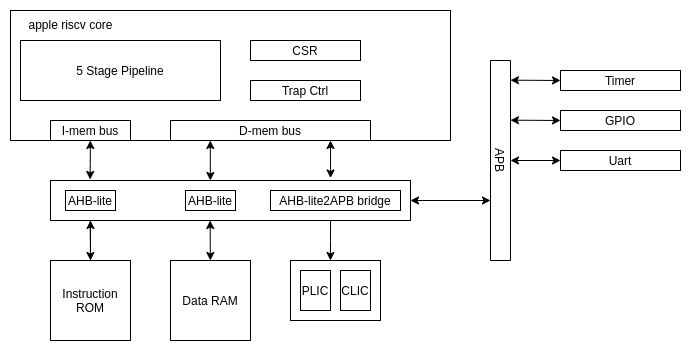

# Micro Architecture

## Apple RISCV soc

The apple riscv soc contains necessary peripherals for the cpu core to run basic embedded task.

The address range for each component is as follow

| Component       | Address Range           | Size |
| --------------- | ----------------------- | ---- |
| Instruction ROM | 0x00000000 - 0x00FFFFFF | 16MB |
| Data RAM        | 0x01000000 - 0x01FFFFFF | 16MB |
| CLIC            | 0x02000000 - 0x02000FFF | 4KB  |
| PLIC            | 0x02001000 - 0x02001FFF | 4KB  |
| Timer           | 0x02002000 - 0x02002FFF | 4KB  |
| GPIO            | 0x02003000 - 0x02003FFF | 4KB  |
| Uart            | 0x02004000 - 0x02004FFF | 4KB  |
